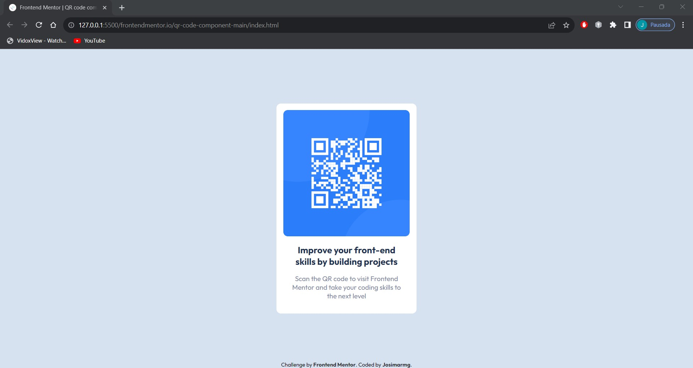

# Frontend Mentor - QR code component solution

[QR code component challenge on Frontend Mentor](https://www.frontendmentor.io/challenges/qr-code-component-iux_sIO_H).

## Table of contents

- [Frontend Mentor - QR code component solution](#frontend-mentor---qr-code-component-solution)
  - [Table of contents](#table-of-contents)
  - [Overview](#overview)
    - [Screenshot](#screenshot)
    - [Links](#links)
  - [My process](#my-process)
    - [Built with](#built-with)
    - [What I learned](#what-i-learned)
    - [Continued development](#continued-development)
    - [Useful resources](#useful-resources)
  - [Author](#author)

## Overview

### Screenshot


Screenshot by: Windows Snipping Tool.

### Links

- Solution URL: [Add solution URL here](https://your-solution-url.com)
- Live Site URL: [Add live site URL here](https://your-live-site-url.com)

## My process

### Built with

- Semantic HTML5 markup
- CSS custom properties
- Flexbox

### What I learned

I learned a little more about positioning with Flexbox and "position".

```css
body {
  display: flex;
  flex-direction: column;
  align-items: center;
}
```
```css
.attribution {
    position: absolute;
    bottom: 0;
    left: 50%;
    transform: translateX(-50%);
}
```
### Continued development

I plan to focus more on 'Grid Layou't so I can create several different types of layouts, I also plan to learn 'Sass' to make 'CSS' rules easier and improve the design of my future projects.

### Useful resources

- [MDN Web Docs](https://developer.mozilla.org/) - On this platform, I like to explore the tutorials and guides to learn HTML, CSS and JavaScript. I like to practice the examples and also use the documentation to better understand frontend web development.
  
- [W3School](https://www.w3schools.com/) - I study interactive tutorials and practical examples on web technologies, such as HTML, CSS, JavaScript. I learn with detailed exercises and references, on this platform I also improve my web development skills.

## Author

- Frontend Mentor - [Josimarmg](https://www.frontendmentor.io/profile/Josimarmg)